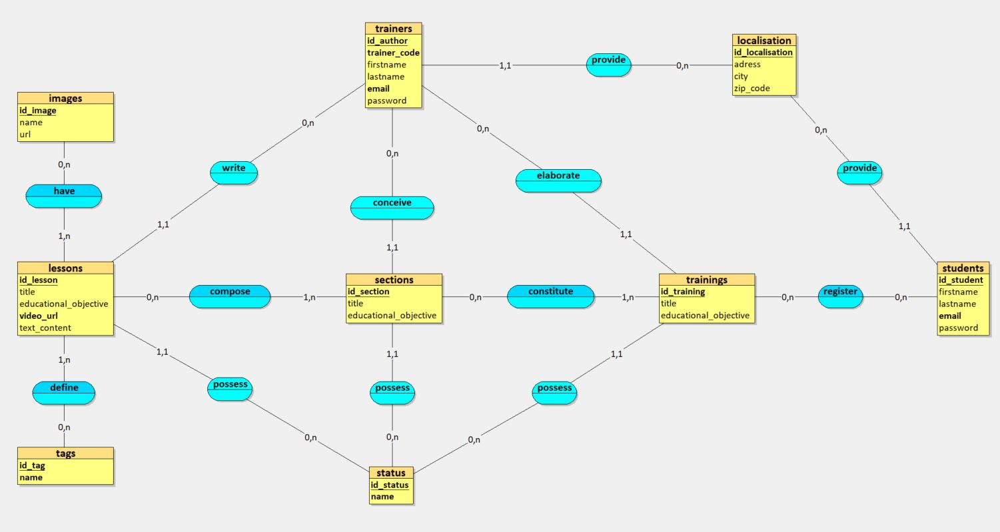

# pire2pire-merise
Ici vous trouverez la réalisation d'un brief Simplon ayant pour objectif de concevoir la base de données d’une plateforme de formation en ligne nommée ***pire2pire*** à l'aide de la méthode **MERISE** (Méthode d'étude et de réalisation informatique pour les systèmes d'entreprise).

Cette dernière est **une méthode d'analyse, de conception et de gestion de projets informatiques** développée en France dans les années 1970 et 1980. Elle se caractérise par une approche systémique et modulaire, permettant de structurer les données, les traitements et les processus d'information. MERISE utilise des **modèles conceptuels** pour représenter les systèmes d'information et **facilite la transition entre les différentes phases de développement**, de l'analyse des besoins à la mise en œuvre.

La phase de conception de la BDD sera découpée ainsi : 

1. [Règles de gestion](#1-règles-de-gestion)

2. [Modèle Conceptuel de Données (MCD)](#2-modèle-conceptuel-de-données-mcd)

3. [Modèle Logique de Données (MLD)](#3-modèle-logique-de-données-mld)

4. [Modèle Physique de Données (MPD)](#4-modèle-physique-de-données-mpd)

5. [Dictionnaire de données](#5-dictionnaire-de-données)

## 1. Règles de gestion

### Visite du site *pire2pire*

- Le visteur peut avoir accès à la page d'accueil de l'application web.
- Le visteur peut prendre connaissance des services proposés par pire2pire.

### Inscription aux services

- Le visiteur peut s'inscrire et devient alors un apprenant ou un formateur.
    - Le visiteur s'inscrira via un formulaire en renseignant ses données personnelles.

### Connexion

- Il existe deux profils : apprenant et formateur.
- L'apprenant ou le formateur peut se connecter via un formulaire de connexion.
    - L'apprenant ou le formateur devra renseigner son email et son mot de passe afin de s'authentifier.
- L'apprenant est caractérisé par un numéro d’inscription unique, un nom, un prénom, une adresse et une date de naissance.
- Le formateur est caractérisé par un numéro d’inscription unique, un code, un nom et un prénom.

### Suppression de compte 

- Un apprenant peut supprimer son compte personnel de la plateforme.

### Gestion des leçons

- La leçon, lorsque publiée, doit contenir :
    - un titre
    - un auteur (formateur)
    - un objectif pédagogique
    - une seule vidéo
    - une ou plusieurs images
    - un ou plusieurs paragraphes
    - un ou plusieurs tags.
- La leçon doit avoir l'un des trois status suivant : 
    - Draft (brouillon) : la leçon est en cours de rédaction par le formateur et n'est pas rendu visible pour les apprenants.
    - Published (publiée) : la leçon est rédigée et visible pour les apprenants
    - Archived (archivée) : la leçon reste uniquement visible pour les apprenants s'étant inscrit à une formation qui possédait un module dans lequel se trouvait cette leçon.
- La leçon est créée par un formateur.
- La leçon peut être modifiée par le formateur qui l'a créée.
- La leçon peut être archivée par le formateur qui l'a créée.
- La leçon peut être entièrement agnostique, c'est-à-dire rattachée à aucun modules.
- La leçon peut être rattachée à un ou plusieurs modules.

### Gestion des modules 

- Le module, lorsque publié, doit contenir : 
    - un titre
    - un auteur (formateur)
    - au minimum une leçon
    - un objectif pédagogique
    - un ou plusieurs tags.
- Le module doit avoir l'un des trois status suivant : 
    - Draft (brouillon) : le module est en cours de rédaction par le formateur et n'est pas rendu visible pour les apprenants.
    - Published (publié) : le module est rédigée et visible pour les apprenants
    - Archived (archivé) : le module reste uniquement visible pour les apprenants s'étant inscrit à une formation qui possédait ce module, sinon il ne sera plus visible pour les prochains inscrit à une formation qui contenait ce module.
- Le module peut contenir une ou plusieurs leçons.
- Le module peut être rattaché à aucune formation. 
- Le modules peut être rattaché à une ou plusieurs formations.
- Le module peut être modifié par le formateur qui l'a créé.
- Le module peut être archivé par le formateur qui l'a créé.
- Si un module est archivé, cela n'entraine pas l'archivage de la ou des leçons qui étaient rattachées à ce dernier.

### Gestion des formations par les formateurs

- La formation, lorsque publiée doit contenir : 
    - un titre
    - un auteur (formateur)
    - au minimum un module
    - un objectif pédagogique
    - un ou plusieurs tags.
- La formation doit avoir l'un des trois status suivant : 
    - Draft (brouillon) : la formation est en cours de rédaction par le formateur et n'est pas rendu visible pour les apprenants.
    - Published (publiée) : la formation est rédigée et visible pour les apprenants
    - Archived (archivée) : la formation reste uniquement visible pour les apprenants s'étant inscrit à celle-ci, sinon elle ne sera plus visible.
- La formation peut contenir un ou plusieurs modules.
- La formation peut être modifiée par le formateur qui l'a créée.
- La formation peut être archivée par le formateur qui l'a créée.
- Si une formation est archivée, alors les apprenants déjà inscrits à cette formation garderont un accès, mais cette dernière ne sera plus visible pour les autres apprenants qui n'étaient pas inscrits.
- Si une formation est archivée, cela n'entraine pas l'archivage du ou des modules qui étaient rattachés à cette dernière.

### Gestion des formations par les apprenants 

- Un apprenant peut s'inscrire à une ou plusieurs formations.
- Un apprenant peut valider manuellement, s'il le souhaite, certains modules présents dans une formation qu'il maîtrise déjà.
- Un apprenant est évalué à chaque leçon avec un statut : "OK" si c'est validé et "KO" si ça ne l'est pas.
- Un module est validé lorsque toutes les leçons à l'intérieur ont un status "OK".
- Une formation est considérée comme terminée lorsque tous les modules ont été validés.

## 2. Modèle Conceptuel de Données (MCD)



## 3. Modèle Logique de Données (MLD)


## 4. Modèle Physique de Données (MPD)

```sql
CREATE TABLE images(
   id_image INT,
   name VARCHAR(100) NOT NULL,
   url VARCHAR(255) NOT NULL,
   PRIMARY KEY(id_image)
);

CREATE TABLE tags(
   id_tag INT,
   name VARCHAR(255) NOT NULL,
   PRIMARY KEY(id_tag),
   UNIQUE(name)
);

CREATE TABLE localisation(
   id_localisation INT,
   adress VARCHAR(100) NOT NULL,
   city VARCHAR(100) NOT NULL,
   zip_code VARCHAR(10) NOT NULL,
   PRIMARY KEY(id_localisation)
);

CREATE TABLE status(
   id_status INT,
   name VARCHAR(20) NOT NULL,
   PRIMARY KEY(id_status),
   UNIQUE(name)
);

CREATE TABLE trainers(
   id_author INT,
   trainer_code VARCHAR(12) NOT NULL,
   firstname VARCHAR(100) NOT NULL,
   lastname VARCHAR(100) NOT NULL,
   email VARCHAR(255) NOT NULL,
   password VARCHAR(255) NOT NULL,
   id_localisation INT NOT NULL,
   PRIMARY KEY(id_author),
   UNIQUE(trainer_code),
   UNIQUE(email),
   FOREIGN KEY(id_localisation) REFERENCES localisation(id_localisation)
);

CREATE TABLE students(
   id_student INT,
   firstname VARCHAR(100) NOT NULL,
   lastname VARCHAR(100) NOT NULL,
   email VARCHAR(255) NOT NULL,
   password VARCHAR(255) NOT NULL,
   id_localisation INT NOT NULL,
   PRIMARY KEY(id_student),
   UNIQUE(email),
   FOREIGN KEY(id_localisation) REFERENCES localisation(id_localisation)
);

CREATE TABLE sections(
   id_section INT,
   title VARCHAR(255) NOT NULL,
   educational_objective TEXT NOT NULL,
   id_author INT NOT NULL,
   id_status INT NOT NULL,
   PRIMARY KEY(id_section),
   FOREIGN KEY(id_author) REFERENCES trainers(id_author),
   FOREIGN KEY(id_status) REFERENCES status(id_status)
);

CREATE TABLE trainings(
   id_training INT,
   title VARCHAR(255) NOT NULL,
   educational_objective TEXT NOT NULL,
   id_author INT NOT NULL,
   id_status INT NOT NULL,
   PRIMARY KEY(id_training),
   FOREIGN KEY(id_author) REFERENCES trainers(id_author),
   FOREIGN KEY(id_status) REFERENCES status(id_status)
);

CREATE TABLE lessons(
   id_lesson INT,
   title VARCHAR(255) NOT NULL,
   educational_objective TEXT NOT NULL,
   video_url VARCHAR(255) NOT NULL,
   text_content TEXT NOT NULL,
   id_status INT NOT NULL,
   id_author INT NOT NULL,
   PRIMARY KEY(id_lesson),
   UNIQUE(video_url),
   FOREIGN KEY(id_status) REFERENCES status(id_status),
   FOREIGN KEY(id_author) REFERENCES trainers(id_author)
);

CREATE TABLE section_lessons(
   id_lesson INT,
   id_section INT,
   PRIMARY KEY(id_lesson, id_section),
   FOREIGN KEY(id_lesson) REFERENCES lessons(id_lesson),
   FOREIGN KEY(id_section) REFERENCES sections(id_section)
);

CREATE TABLE training_sections(
   id_section INT,
   id_training INT,
   PRIMARY KEY(id_section, id_training),
   FOREIGN KEY(id_section) REFERENCES sections(id_section),
   FOREIGN KEY(id_training) REFERENCES trainings(id_training)
);

CREATE TABLE student_trainings(
   id_student INT,
   id_training INT,
   PRIMARY KEY(id_student, id_training),
   FOREIGN KEY(id_student) REFERENCES students(id_student),
   FOREIGN KEY(id_training) REFERENCES trainings(id_training)
);

CREATE TABLE lesson_tags(
   id_lesson INT,
   id_tag INT,
   PRIMARY KEY(id_lesson, id_tag),
   FOREIGN KEY(id_lesson) REFERENCES lessons(id_lesson),
   FOREIGN KEY(id_tag) REFERENCES tags(id_tag)
);

CREATE TABLE lesson_images(
   id_lesson INT,
   id_image INT,
   PRIMARY KEY(id_lesson, id_image),
   FOREIGN KEY(id_lesson) REFERENCES lessons(id_lesson),
   FOREIGN KEY(id_image) REFERENCES images(id_image)
);

```

## 5. Dictionnaire de données

| Entité                | Attribut              | Type de Données | Longueur | Contraintes                                                                     | Description                                        | Exemple                                |
| --------------------- | --------------------- | --------------- | -------- | ------------------------------------------------------------------------------- | -------------------------------------------------- | -------------------------------------- |
| **images**            | id_image              | INT             | -        | PRIMARY KEY                                                                     | Identifiant unique pour chaque image.              | 1                                      |
|                       | name                  | VARCHAR         | 100      | NOT NULL                                                                        | Nom de l'image.                                    | profile_pic.png                        |
|                       | url                   | VARCHAR         | 255      | NOT NULL                                                                        | URL de l'image.                                    | http://example.com/img/profile_pic.png |
| **tags**              | id_tag                | INT             | -        | PRIMARY KEY, UNIQUE(name)                                                       | Identifiant unique pour chaque tag.                | 1                                      |
|                       | name                  | VARCHAR         | 255      | NOT NULL                                                                        | Nom du tag.                                        | Education                              |
| **localisation**      | id_localisation       | INT             | -        | PRIMARY KEY                                                                     | Identifiant unique pour chaque localisation.       | 1                                      |
|                       | adress                | VARCHAR         | 100      | NOT NULL                                                                        | Adresse.                                           | 123 Rue de Paris                       |
|                       | city                  | VARCHAR         | 100      | NOT NULL                                                                        | Ville.                                             | Paris                                  |
|                       | zip_code              | VARCHAR         | 10       | NOT NULL                                                                        | Code postal.                                       | 75000                                  |
| **status**            | id_status             | INT             | -        | PRIMARY KEY, UNIQUE(name)                                                       | Identifiant unique pour chaque statut.             | 1                                      |
|                       | name                  | VARCHAR         | 20       | NOT NULL                                                                        | Nom du statut.                                     | active                                 |
| **trainers**          | id_author             | INT             | -        | PRIMARY KEY, UNIQUE(trainer_code), UNIQUE(email)                                | Identifiant unique pour chaque formateur.          | 1                                      |
|                       | trainer_code          | VARCHAR         | 12       | NOT NULL                                                                        | Code unique du formateur.                          | ABC123                                 |
|                       | firstname             | VARCHAR         | 100      | NOT NULL                                                                        | Prénom du formateur.                               | John                                   |
|                       | lastname              | VARCHAR         | 100      | NOT NULL                                                                        | Nom de famille du formateur.                       | Doe                                    |
|                       | email                 | VARCHAR         | 255      | NOT NULL                                                                        | Adresse email du formateur (unique).               | john.doe@example.com                   |
|                       | password              | VARCHAR         | 255      | NOT NULL                                                                        | Mot de passe du formateur.                         | **\*\*\*\***                           |
|                       | id_localisation       | INT             | -        | NOT NULL, FOREIGN KEY(id_localisation) REFERENCES localisation(id_localisation) | Identifiant de la localisation du formateur.       | 1                                      |
| **students**          | id_student            | INT             | -        | PRIMARY KEY, UNIQUE(email)                                                      | Identifiant unique pour chaque étudiant.           | 1                                      |
|                       | firstname             | VARCHAR         | 100      | NOT NULL                                                                        | Prénom de l'étudiant.                              | Jane                                   |
|                       | lastname              | VARCHAR         | 100      | NOT NULL                                                                        | Nom de famille de l'étudiant.                      | Smith                                  |
|                       | email                 | VARCHAR         | 255      | NOT NULL                                                                        | Adresse email de l'étudiant (unique).              | jane.smith@example.com                 |
|                       | password              | VARCHAR         | 255      | NOT NULL                                                                        | Mot de passe de l'étudiant.                        | **\*\*\*\***                           |
|                       | id_localisation       | INT             | -        | NOT NULL, FOREIGN KEY(id_localisation) REFERENCES localisation(id_localisation) | Identifiant de la localisation de l'étudiant.      | 1                                      |
| **sections**          | id_section            | INT             | -        | PRIMARY KEY                                                                     | Identifiant unique pour chaque section.            | 1                                      |
|                       | title                 | VARCHAR         | 255      | NOT NULL                                                                        | Titre de la section.                               | Introduction à SQL                     |
|                       | educational_objective | TEXT            | -        | NOT NULL                                                                        | Objectif éducatif de la section.                   | Apprendre les bases                    |
|                       | id_author             | INT             | -        | NOT NULL, FOREIGN KEY(id_author) REFERENCES trainers(id_author)                 | Identifiant de l'auteur de la section.             | 1                                      |
|                       | id_status             | INT             | -        | NOT NULL, FOREIGN KEY(id_status) REFERENCES status(id_status)                   | Identifiant du statut de la section.               | 1                                      |
| **trainings**         | id_training           | INT             | -        | PRIMARY KEY                                                                     | Identifiant unique pour chaque formation.          | 1                                      |
|                       | title                 | VARCHAR         | 255      | NOT NULL                                                                        | Titre de la formation.                             | Formation en Python                    |
|                       | educational_objective | TEXT            | -        | NOT NULL                                                                        | Objectif éducatif de la formation.                 | Maîtriser Python                       |
|                       | id_author             | INT             | -        | NOT NULL, FOREIGN KEY(id_author) REFERENCES trainers(id_author)                 | Identifiant de l'auteur de la formation.           | 1                                      |
|                       | id_status             | INT             | -        | NOT NULL, FOREIGN KEY(id_status) REFERENCES status(id_status)                   | Identifiant du statut de la formation.             | 1                                      |
| **lessons**           | id_lesson             | INT             | -        | PRIMARY KEY, UNIQUE(video_url)                                                  | Identifiant unique pour chaque leçon.              | 1                                      |
|                       | title                 | VARCHAR         | 255      | NOT NULL                                                                        | Titre de la leçon.                                 | Introduction à Python                  |
|                       | educational_objective | TEXT            | -        | NOT NULL                                                                        | Objectif éducatif de la leçon.                     | Comprendre les bases                   |
|                       | video_url             | VARCHAR         | 255      | NOT NULL                                                                        | URL de la vidéo de la leçon (unique).              | http://example.com/video/intro_python  |
|                       | text_content          | TEXT            | -        | NOT NULL                                                                        | Contenu textuel de la leçon.                       | Contenu ici                            |
|                       | id_status             | INT             | -        | NOT NULL, FOREIGN KEY(id_status) REFERENCES status(id_status)                   | Identifiant du statut de la leçon.                 | 1                                      |
|                       | id_author             | INT             | -        | NOT NULL, FOREIGN KEY(id_author) REFERENCES trainers(id_author)                 | Identifiant de l'auteur de la leçon.               | 1                                      |
| **section_lessons**   | id_lesson             | INT             | -        | PRIMARY KEY, FOREIGN KEY(id_lesson) REFERENCES lessons(id_lesson)               | Identifiant de la leçon associée à la section.     | 1                                      |
|                       | id_section            | INT             | -        | PRIMARY KEY, FOREIGN KEY(id_section) REFERENCES sections(id_section)            | Identifiant de la section associée à la leçon.     | 1                                      |
| **training_sections** | id_section            | INT             | -        | PRIMARY KEY, FOREIGN KEY(id_section) REFERENCES sections(id_section)            | Identifiant de la section associée à la formation. | 1                                      |
|                       | id_training           | INT             | -        | PRIMARY KEY, FOREIGN KEY(id_training) REFERENCES trainings(id_training)         | Identifiant de la formation associée à la section. | 1                                      |
| **student_trainings** | id_student            | INT             | -        | PRIMARY KEY, FOREIGN KEY(id_student) REFERENCES students(id_student)            | Identifiant de l'étudiant associé à la formation.  | 1                                      |
|                       | id_training           | INT             | -        | PRIMARY KEY, FOREIGN KEY(id_training) REFERENCES trainings(id_training)         | Identifiant de la formation associée à l'étudiant. | 1                                      |
| **lesson_tags**       | id_lesson             | INT             | -        | PRIMARY KEY, FOREIGN KEY(id_lesson) REFERENCES lessons(id_lesson)               | Identifiant de la leçon associée au tag.           | 1                                      |
|                       | id_tag                | INT             | -        | PRIMARY KEY, FOREIGN KEY(id_tag) REFERENCES tags(id_tag)                        | Identifiant du tag associé à la leçon.             | 1                                      |
| **lesson_images**     | id_lesson             | INT             | -        | PRIMARY KEY, FOREIGN KEY(id_lesson) REFERENCES lessons(id_lesson)               | Identifiant de la leçon associée à l'image.        | 1                                      |
|                       | id_image              | INT             | -        | PRIMARY KEY, FOREIGN KEY(id_image) REFERENCES images(id_image)                  | Identifiant de l'image associée à la leçon.        | 1                                      |
